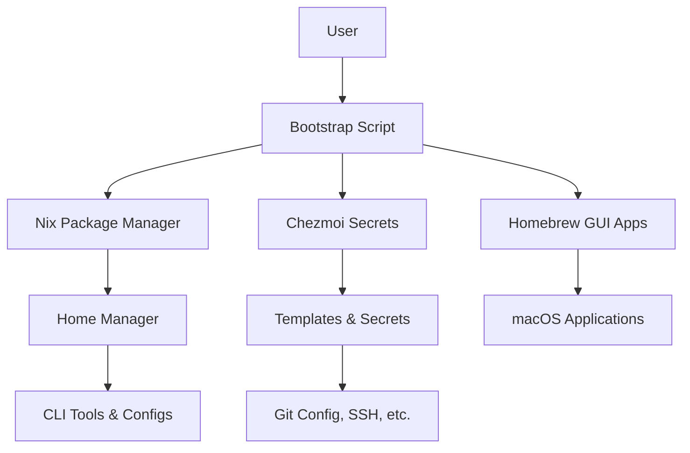

# Architecture Overview

This dotfiles system uses a **clean separation of concerns** between different tools, ensuring no conflicts and clear responsibilities.

## System Overview



## Tool Responsibilities

### 🔧 **Nix & Home Manager**
**Purpose**: Declarative package and configuration management

- ✅ All command-line tools and packages
- ✅ Shell configurations (Fish, Bash, Zsh)
- ✅ Tool configurations (Git, Starship, etc.)
- ✅ Environment variables
- ✅ Reproducible, version-controlled setup

### 🔐 **Chezmoi**
**Purpose**: Secrets and machine-specific templating

- ✅ Git user credentials
- ✅ SSH configurations with private details
- ✅ API keys and tokens
- ✅ Machine-specific paths and settings

### 🍺 **Homebrew**
**Purpose**: macOS GUI applications

- ✅ Desktop applications
- ✅ App Store apps
- ✅ macOS-specific tools

## Directory Structure

```
~/.dotfiles/
├── bootstrap.sh           # Main setup script
├── nix/
│   └── home.nix           # Package & config declarations
├── chezmoi/
│   ├── chezmoi.toml       # User-specific values
│   ├── dot_gitconfig.tmpl # Git config template
│   └── private_dot_ssh/   # SSH configs with secrets
├── brew/
│   └── Brewfile          # macOS GUI applications
├── scripts/              # Utility and setup scripts
└── docs/                 # This documentation site
```

## Why This Architecture?

### Previous Problems
- Multiple tools managing the same files created conflicts
- Having Chezmoi manage `home.nix` was confusing
- Changes required coordination between multiple tools
- Secrets could accidentally end up in public Nix store

### Current Benefits

#### 1. **Clear Separation**
Each tool has a specific, non-overlapping responsibility.

#### 2. **Simple Workflows**
- Need a new package? Edit `nix/home.nix`
- Need to update secrets? Edit Chezmoi templates
- Need a new app? Add to `brew/Brewfile`

#### 3. **Security**
Secrets stay in Chezmoi templates, never in the public Nix store.

#### 4. **Reproducibility**
The same `home.nix` works across multiple machines.

## Common Workflows

### Adding Packages or Changing Configuration

```bash
# Edit the configuration
$EDITOR ~/.dotfiles/nix/home.nix

# Apply changes
home-manager switch
```

### Managing Secrets

```bash
# Edit secret templates
$EDITOR ~/.dotfiles/chezmoi/chezmoi.toml

# Apply secret changes
chezmoi apply
```

### Adding macOS Applications

```bash
# Edit Brewfile
$EDITOR ~/.dotfiles/brew/Brewfile

# Install new apps
brew bundle --file ~/.dotfiles/brew/Brewfile
```

## Best Practices

### 🔒 **Security**
- **Never put secrets in `nix/home.nix`** - They end up in world-readable Nix store
- **Use Chezmoi templates** for anything private or machine-specific
- **Document secret variables** in `chezmoi.toml` comments

### 📦 **Package Management**
- **Keep all CLI tools in Nix** for reproducibility
- **Use Homebrew only for GUI applications**
- **Pin versions** when stability is critical

### 🔄 **Maintenance**
- **Test changes** on a secondary machine first
- **Keep configurations minimal** - prefer defaults when possible
- **Document customizations** with comments explaining why

## Examples

### What Goes Where?

#### Nix/Home Manager (`nix/home.nix`)
```nix
home.packages = with pkgs; [
  ripgrep      # CLI tools
  bat          # Always in Nix
  eza
];

programs.git = {
  enable = true;
  # Public config only
  aliases = {
    st = "status";
    co = "checkout";
  };
};
```

#### Chezmoi Templates (`chezmoi/dot_gitconfig.tmpl`)
```gitconfig
[user]
    name = {{ .git.name }}
    email = {{ .git.email }}

[github]
    user = {{ .github.username }}
```

#### Homebrew (`brew/Brewfile`)
```ruby
# GUI Applications only
cask "visual-studio-code"
cask "docker"
cask "spotify"
```

This architecture ensures your development environment is both secure and reproducible! 🚀
